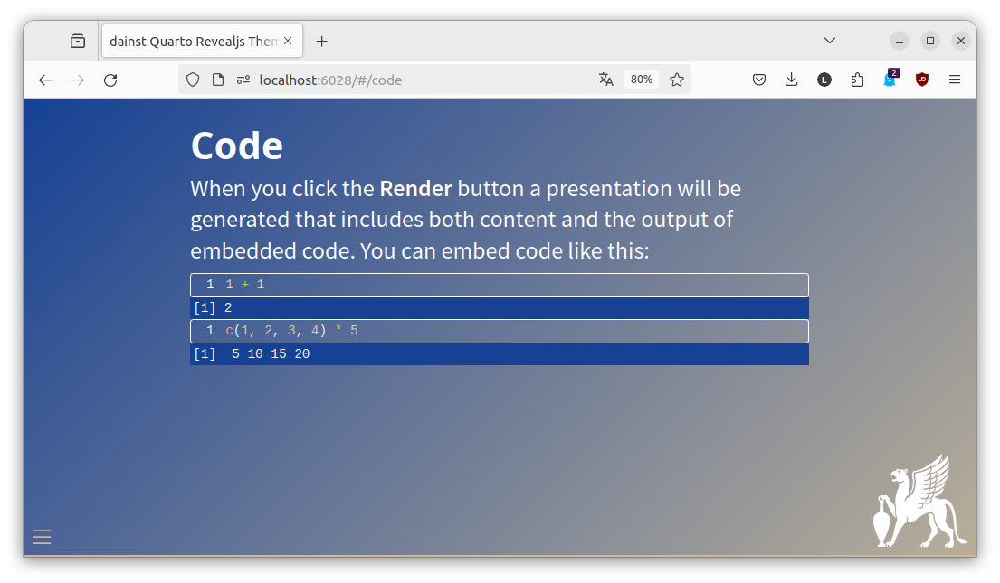

# dainst quarto/revealjs theme

This is the repository of the dainst theme for a theme for using `Quarto` with `reveal.js`, e.g. for use in RStudio.



The code to create this example is available [in the template directory](https://github.com/dainst/dainst-revealjs-theme/tree/main/template) of this repository.

## How to install

This is not an installable [Quarto](https://quarto.org) extension. But you can simply copy the 'template' directory as a template for new presentations. If you want to use this template for an existing presentation, copy `dainst.scss` and the logo (`greif_w.png`) in the same directory as your `qmd` file and add this to you YAML:

```
format: 
  revealjs: 
    theme: [default, dainst.scss]
    logo: greif_w.png
```
